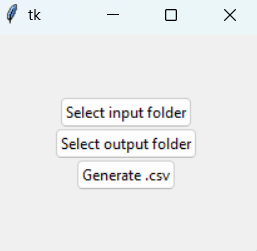

# Saudi ZATCA QR Code Processor

## Overview
This project simplifies the process of extracting and inputting tax details from receipts in accordance with the Saudi Zakat, Tax, and Customs Authority (ZATCA) specifications. The application reads QR codes from receipt images, decodes the tax details, and compiles them into a neatly formatted CSV file. The solution leverages various AI libraries and is designed with user-friendliness in mind, particularly for accountants without technical backgrounds.

## Motivation
During my winter break, I visited my father’s company and learned about the challenges they faced with the new Saudi tax system, ZATCA. They had to manually enter tax details from receipts due to budget constraints, making the process time-consuming and error-prone. 

I noticed that every receipt included a QR code containing the required tax details. However, scanning the QR codes with generic tools yielded unreadable strings. After researching the ZATCA system, I discovered that these strings were TLV-encoded in Base64 format. This realization inspired me to create a program that automates the decoding and data entry process.

## Implementation
The application utilizes the following technologies and libraries:
- **`uttlv`**: For decoding TLV (Tag-Length-Value) encoded data.
- **`qreader`**: For detecting and decoding QR codes in images.
- **OpenCV**: For image processing, including converting images to grayscale.
- **Pandas**: For managing and exporting the extracted data into a CSV file.
- **Tkinter**: For creating a user-friendly GUI.

### Learning Phase
To ensure a robust implementation, I first familiarized myself with these libraries by testing their capabilities and limitations.

## Approach

### First Approach
A terminal-based program that takes the image path as input and displays extracted details in the terminal. While functional, this approach didn’t solve the problem for non-technical users.

### Second Approach
I developed a GUI using Tkinter to make the program accessible to accountants. Initially, the program allowed selecting individual images to generate a CSV file. However, processing multiple QR codes from a single image or folder proved inefficient, as increasing the input volume caused significant performance bottlenecks. This approach was ultimately scrapped.

### Third Approach (Final)
I refined the program to process each image individually, regardless of the number of QR codes it contains. Each image is processed in an iterative manner, updating a pre-initialized DataFrame after extracting the required details.

#### Workflow
1. **Image Processing**:
    - Read all valid images from a folder using OpenCV.
    - Convert each image to grayscale.
2. **QR Code Decoding**:
    - Use the `qreader` library to detect and decode QR codes.
    - Decode the Base64-encoded TLV string from each QR code.
3. **Data Extraction**:
    - Use the `uttlv` library to parse the TLV data.
    - Extract and decode the relevant fields as specified by ZATCA.
4. **CSV Generation**:
    - Populate a Pandas DataFrame with the extracted details.
    - Export the DataFrame to a CSV file.

#### Code Snippets
**QR Code Processing:**
```python
# Iterate through each image in the folder
for i in images:
    # Initialize the QReader to detect QR codes
    qreader = QReader()
    
    # Convert the image to grayscale for better QR code recognition
    image = cv2.cvtColor(i, cv2.COLOR_BGR2GRAY)
    
    # Decode the QR code(s) in the image
    decoded_text = qreader.detect_and_decode(image=image)
    
    # Iterate through each detected QR code and process it
    for t in decoded_text:
        # Decode the Base64-encoded TLV string
        temp = base64.b64decode(t)
        
        # Add the extracted data to the CSV file
        df = add_to_csv(temp)
```

**TLV Decoding:**
```python
from uttlv import TLV

# Function to decode TLV data and add it to the DataFrame
def add_to_csv(temp):
    # Initialize the TLV parser
    t = TLV()
    
    # Parse the Base64-decoded TLV data into an array
    t.parse_array(temp)
    
    # Extract the required fields and decode them as per ZATCA specifications
    df.loc[len(df)] = [
        t[0x01].decode('utf-8'),   # Seller's name
        t[0x02].decode('utf-8-sig'), # VAT registration number
        t[0x03].decode('utf-8'),   # Invoice date and time
        t[0x04].decode('utf-8'),   # Total amount
        t[0x05].decode('utf-8')    # VAT amount
    ]
    
    # Return the updated DataFrame
    return df
```

**Folder Iteration:**
```python
import os
import cv2

# Function to read all images from a folder
images = []
for filename in os.listdir(folder):
    # Use OpenCV to read the image file
    img = cv2.imread(os.path.join(folder, filename))
    
    # If the file is not an image, skip it
    if img is not None:
        images.append(img)

# Return the final list of images
return images
```

## Error Handling
1. **Input Errors:**
    - **File instead of folder**: Handled by Tkinter’s `askdirectory` function.
    - **Non-image files in folder**: Skipped using OpenCV’s `imread`, which returns `None` for non-images.
2. **Invalid QR Codes:**
    - A `try-except` block handles exceptions from the `uttlv` library.

Example:
```python
try:
    t = TLV()
    t.parse_array(temp)
    df.loc[len(df)] = [
        t[0x01].decode('utf-8'),   
        t[0x02].decode('utf-8-sig'), 
        t[0x03].decode('utf-8'),   
        t[0x04].decode('utf-8'),   
        t[0x05].decode('utf-8')    
    ]
    return df
except:
    # Handle any parsing errors and return the DataFrame as-is
    return df
```

## GUI
The GUI, built with Tkinter, simplifies the user interaction:
- Users can select a folder containing receipt images.
- The program processes each image and generates a CSV file.



## Future Improvements
- Enhance the GUI for better usability and aesthetics.
- Add support for multi-threading to improve performance with large datasets.
- Incorporate additional error messages to guide users in resolving common issues.

## Conclusion
This project automates the tedious process of extracting and organizing tax details from receipts, saving time and effort for businesses. With further improvements, it can become an indispensable tool for managing tax compliance in accordance with ZATCA specifications.

## License
This project is licensed under the [MIT License](LICENSE).

## Contributions
Contributions, issues, and feature requests are welcome! Feel free to open a pull request or an issue.

